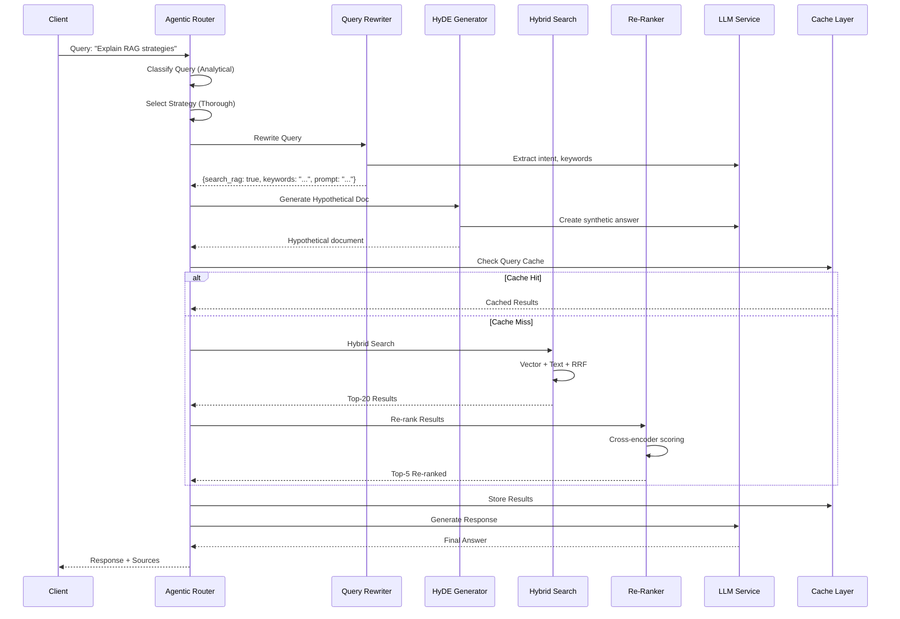

# Design: 11 Advanced RAG Strategies Architecture

## Executive Summary

This design implements 11 advanced RAG strategies from Gaurav Shrivastav's research to boost RAG system accuracy to 94%. The architecture is modular, allowing individual strategies to be toggled and combined based on query characteristics.

## System Architecture

```
┌─────────────────────────────────────────────────────────────────────────────┐
│                              CLIENT LAYER                                    │
│  HTTP/REST API │ WebSocket │ SDK                                            │
└─────────────────────────────────────────────────────────────────────────────┘
                                      │
                                      ▼
┌─────────────────────────────────────────────────────────────────────────────┐
│                           ORCHESTRATION LAYER                              │
│  ┌───────────────────────────────────────────────────────────────────────┐  │
│  │                     Agentic RAG Router                                │  │
│  │  - Query Classification  - Strategy Selection  - Self-Correction      │  │
│  └───────────────────────────────────────────────────────────────────────┘  │
└─────────────────────────────────────────────────────────────────────────────┘
                                      │
         ┌────────────────────────────┼────────────────────────────┐
         │                            │                            │
         ▼                            ▼                            ▼
┌─────────────────────┐  ┌─────────────────────┐  ┌─────────────────────┐
│   QUERY PIPELINE    │  │  RETRIEVAL PIPELINE │  │  RESPONSE PIPELINE  │
├─────────────────────┤  ├─────────────────────┤  ├─────────────────────┤
│ Query Rewriting     │  │ Hybrid Search       │  │ Context Assembly    │
│ ├─ Intent Extract   │  │ ├─ Vector Search    │  │ LLM Generation      │
│ ├─ Noise Removal    │  │ ├─ Text Search      │  │ Response Formatting │
│ └─ LLM Prompt Gen   │  │ └─ RRF Fusion       │  │ Caching             │
│                     │  │                     │  │                     │
│ HyDE Generator      │  │ Metadata Filtering  │  │ Evaluation          │
│ ├─ Hypo Document    │  │                     │  │ └─ Quality Metrics  │
│ └─ Semantic Embed   │  │ Re-ranking          │  │                     │
│                     │  │ ├─ Cross-Encoder    │  │                     │
│                     │  │ └─ Score Fusion     │  │                     │
└─────────────────────┘  └─────────────────────┘  └─────────────────────┘
                                      │
                                      ▼
┌─────────────────────────────────────────────────────────────────────────────┐
│                           PROCESSING LAYER                                  │
│  ┌──────────────┐  ┌──────────────┐  ┌──────────────┐  ┌──────────────┐   │
│  │   Chunking   │  │  Contextual  │  │   Multi-     │  │  Embedding   │   │
│  │   Service    │  │  Retrieval   │  │   Modal      │  │  Optimizer   │   │
│  ├──────────────┤  ├──────────────┤  ├──────────────┤  ├──────────────┤   │
│  │ Semantic     │  │ Parent Doc   │  │ Image Proc   │  │ Model Select │   │
│  │ Hierarchical │  │ Hierarchical │  │ Audio Proc   │  │ Dimension    │   │
│  │ Fixed-Size   │  │ Window       │  │ Video Proc   │  │ Reduction    │   │
│  │ Agentic      │  │              │  │              │  │ Quantization │   │
│  └──────────────┘  └──────────────┘  └──────────────┘  └──────────────┘   │
└─────────────────────────────────────────────────────────────────────────────┘
                                      │
                                      ▼
┌─────────────────────────────────────────────────────────────────────────────┐
│                           DATA LAYER                                        │
│  ┌──────────────┐  ┌──────────────┐  ┌──────────────┐  ┌──────────────┐   │
│  │   PostgreSQL │  │   pgvector   │  │    Redis     │  │     S3       │   │
│  │   (Primary)  │  │  (Vectors)   │  │   (Cache)    │  │  (Media)     │   │
│  ├──────────────┤  ├──────────────┤  ├──────────────┤  ├──────────────┤   │
│  │ Documents    │  │ Embeddings   │  │ L1 Cache     │  │ Images       │   │
│  │ Chunks       │  │ HNSW Index   │  │ Hot Data     │  │ Audio        │   │
│  │ Metadata     │  │ IVFFlat Idx  │  │ Sessions     │  │ Video        │   │
│  │ Hierarchy    │  │ Search Ops   │  │ Rate Limits  │  │ Originals    │   │
│  └──────────────┘  └──────────────┘  └──────────────┘  └──────────────┘   │
└─────────────────────────────────────────────────────────────────────────────┘
```

## Component Interactions



## Strategy Configuration Matrix

| Query Type | Query Rewrite | HyDE | Hybrid | Re-rank | Caching |
|------------|---------------|------|--------|---------|---------|
| Factual | ✅ | ❌ | ✅ | ✅ | ✅ |
| Analytical | ✅ | ✅ | ✅ | ✅ | ✅ |
| Comparative | ✅ | ❌ | ✅ | ✅ | ✅ |
| Vague | ✅ | ✅ | ✅ | ✅ | ❌ |
| Multi-hop | ✅ | ✅ | ✅ | ✅ | ❌ |

## Data Flow

### 1. Document Ingestion Flow
```
Document Upload
      │
      ▼
┌─────────────┐
│  Parse      │
└──────┬──────┘
       │
       ▼
┌─────────────┐     ┌─────────────┐
│   Chunking  │────▶│  Strategy   │
│   Service   │     │  Selection  │
└──────┬──────┘     └─────────────┘
       │
       ▼
┌─────────────┐
│  Contextual │
│  Enhancement│
└──────┬──────┘
       │
       ▼
┌─────────────┐     ┌─────────────┐
│   Embed     │────▶│   Store     │
└─────────────┘     └─────────────┘
```

### 2. Query Processing Flow
```
User Query
      │
      ▼
┌─────────────┐     ┌─────────────┐
│   Agentic   │────▶│  Classify   │
│   Router    │     │   Query     │
└──────┬──────┘     └─────────────┘
       │
       ▼
┌─────────────┐     ┌─────────────┐
│   Strategy  │────▶│   Select    │
│   Selection │     │   Config    │
└──────┬──────┘     └─────────────┘
       │
       ├──▶ Query Rewrite ──▶ HyDE (if enabled)
       │
       ▼
┌─────────────┐     ┌─────────────┐
│    Cache    │────▶│   Check     │
│    Layer    │     │   L1, L2    │
└──────┬──────┘     └─────────────┘
       │
       ├──▶ Cache Hit → Return
       │
       ▼
┌─────────────┐     ┌─────────────┐
│   Hybrid    │────▶│  Metadata   │
│   Search    │     │   Filter    │
└──────┬──────┘     └─────────────┘
       │
       ▼
┌─────────────┐     ┌─────────────┐
│  Re-rank    │────▶│  Cross-     │
│  Service    │     │  Encoder    │
└──────┬──────┘     └─────────────┘
       │
       ▼
┌─────────────┐     ┌─────────────┐
│    LLM      │────▶│  Generate   │
│  Generation │     │   Answer    │
└──────┬──────┘     └─────────────┘
       │
       ▼
┌─────────────┐     ┌─────────────┐
│    Cache    │────▶│   Store     │
│   Result    │     │  All Layers │
└──────┬──────┘     └─────────────┘
       │
       ▼
    Response
```

## API Endpoints

### New Endpoints

```yaml
# Query Processing
POST /api/v1/rag/query
  body:
    query: string
    strategy: "auto" | "fast" | "balanced" | "thorough"
    context:
      conversation_id: string
      previous_messages: []
  response:
    answer: string
    sources: []
    metrics:
      latency_ms: number
      tokens_used: number
      strategy_used: string

# Strategy Management
GET /api/v1/rag/strategies
  response:
    strategies: []
    defaults: {}

POST /api/v1/rag/strategies/{name}/evaluate
  body:
    test_queries: []
  response:
    metrics: {}

# Evaluation
GET /api/v1/rag/metrics
  query:
    start_date: string
    end_date: string
  response:
    retrieval_metrics: {}
    generation_metrics: {}
    cost_metrics: {}

POST /api/v1/rag/evaluate
  body:
    benchmark: string
  response:
    results: {}
```

## Database Schema Updates

### New Tables

```sql
-- Query classification log
CREATE TABLE query_classifications (
    id UUID PRIMARY KEY DEFAULT gen_random_uuid(),
    query_id UUID REFERENCES queries(id),
    query_type VARCHAR(50),
    confidence FLOAT,
    selected_strategy VARCHAR(50),
    created_at TIMESTAMP DEFAULT NOW()
);

-- Strategy usage metrics
CREATE TABLE strategy_metrics (
    id UUID PRIMARY KEY DEFAULT gen_random_uuid(),
    strategy_name VARCHAR(100),
    query_count INTEGER,
    avg_latency_ms FLOAT,
    cache_hit_rate FLOAT,
    success_rate FLOAT,
    recorded_at TIMESTAMP DEFAULT NOW()
);

-- Enhanced chunks with context
ALTER TABLE chunks ADD COLUMN IF NOT EXISTS parent_document_id UUID;
ALTER TABLE chunks ADD COLUMN IF NOT EXISTS section_headers TEXT[];
ALTER TABLE chunks ADD COLUMN IF NOT EXISTS context_type VARCHAR(50);
ALTER TABLE chunks ADD COLUMN IF NOT EXISTS embedding_model VARCHAR(100);

-- Semantic cache
CREATE TABLE semantic_cache (
    id UUID PRIMARY KEY DEFAULT gen_random_uuid(),
    query_embedding VECTOR(1536),
    query_text TEXT,
    result_json JSONB,
    similarity_threshold FLOAT,
    hit_count INTEGER DEFAULT 0,
    created_at TIMESTAMP DEFAULT NOW(),
    last_accessed TIMESTAMP DEFAULT NOW()
);
CREATE INDEX idx_semantic_cache_embedding ON semantic_cache 
    USING ivfflat (query_embedding vector_cosine_ops);
```

## Performance Targets

| Metric | Target | Measurement |
|--------|--------|-------------|
| End-to-end latency (p50) | <200ms | Query to response |
| End-to-end latency (p95) | <500ms | Query to response |
| Retrieval accuracy (NDCG@10) | >0.85 | Benchmark eval |
| Answer relevance (BERTScore) | >0.85 | Human eval |
| Cache hit rate | >70% | L1 + L2 + L3 |
| Cost per query | <$0.01 | Embedding + LLM |
| Throughput | 100 req/s | Sustained |

## Cost Optimization

### Without Caching (Estimated)
| Component | Cost/1K Queries |
|-----------|-----------------|
| Embeddings | $0.10 |
| LLM (Query Rewrite) | $0.50 |
| LLM (HyDE) | $0.80 |
| LLM (Generation) | $2.00 |
| Re-ranking | $0.05 |
| **Total** | **$3.45** |

### With Caching (70% hit rate)
| Component | Cost/1K Queries |
|-----------|-----------------|
| Embeddings | $0.03 (70% cached) |
| LLM (Query Rewrite) | $0.15 (70% cached) |
| LLM (HyDE) | $0.24 (70% cached) |
| LLM (Generation) | $0.60 (70% cached) |
| Re-ranking | $0.05 |
| **Total** | **$1.07** |

**Savings: 69% cost reduction**

## Security Considerations

1. **Prompt Injection**: Sanitize user queries before LLM processing
2. **Data Leakage**: Cache isolation per tenant
3. **Rate Limiting**: Per-user and per-strategy limits
4. **Audit Logging**: Log all strategy selections and results

## Deployment Strategy

### Phase 1: Foundation (Week 1-2)
- Query Rewriting
- HyDE
- Re-ranking
- Basic caching

### Phase 2: Intelligence (Week 3)
- Agentic routing
- Strategy selection
- Self-correction

### Phase 3: Optimization (Week 4)
- Evaluation framework
- Advanced caching
- Performance tuning

### Phase 4: Scale (Week 5)
- Multi-modal support
- Load testing
- Documentation

## Monitoring & Alerting

### Key Metrics
```yaml
alerts:
  - name: "High Latency"
    condition: "p95_latency > 500ms for 5m"
    severity: warning
    
  - name: "Low Cache Hit Rate"
    condition: "cache_hit_rate < 50% for 10m"
    severity: warning
    
  - name: "RAG Quality Drop"
    condition: "ndcg@10 < 0.7 for 30m"
    severity: critical
    
  - name: "High Error Rate"
    condition: "error_rate > 5% for 5m"
    severity: critical
```

## Conclusion

This architecture provides a modular, extensible foundation for implementing all 11 advanced RAG strategies. The agentic routing layer enables dynamic strategy selection, while the multi-layer caching ensures cost-effective operation at scale.
